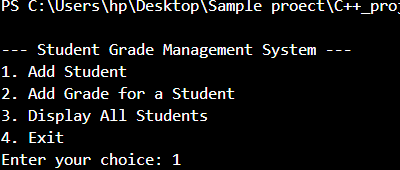

# Student Grade Management System

A simple C++ application to manage student information, record grades, and compute the average grade. This project demonstrates basic file I/O and object-oriented programming principles.

## Features
- Add student details (name, roll number, grade).
- View all student records.
- Calculate the average grade of all students.
- Save student records to a file.
- Load student records from a file.

## Technologies Used
- C++
- Standard Template Library (STL) for data structures (vector).

## Getting Started

### Prerequisites
- C++ compiler (e.g., g++, clang++).
- Basic knowledge of C++ programming.

### Compilation and Execution
1. Save the code to a file named `student_management.cpp`.
2. Open your terminal and navigate to the directory containing the file.
3. Compile the program:
   ```bash
   g++ student_management.cpp -o student_management
## Run the program:

./student_management
#Usage
-Follow the on-screen prompts to add students, view records, calculate average grades, and save/load data.
-Student data is saved in a file named students.txt.
## License
-This project is licensed under the MIT License.

### Acknowledgments
-This project was created to practice C++ programming concepts and demonstrate basic functionality for managing student records.
### View


